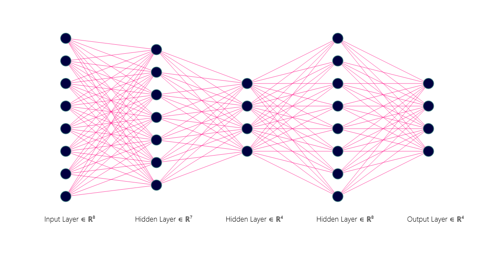
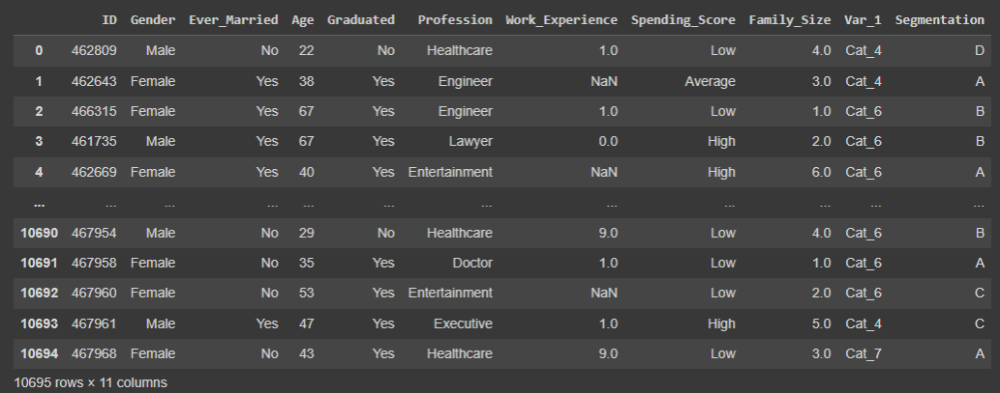
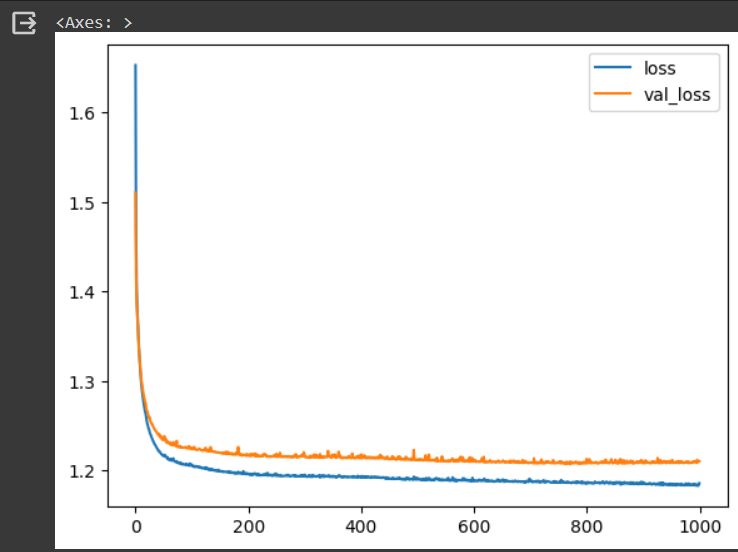
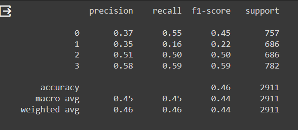
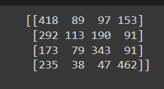
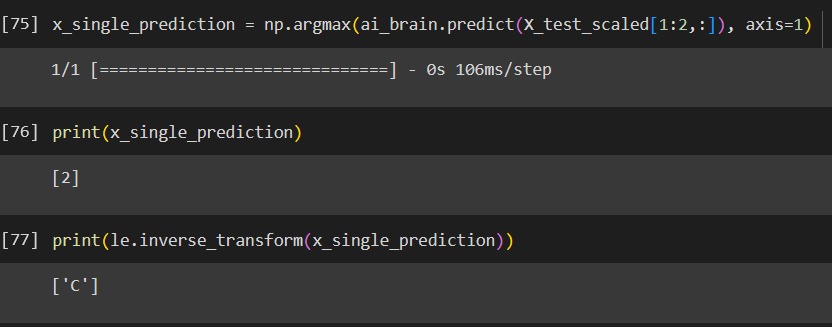

# Developing a Neural Network Classification Model

## AIM

To develop a neural network classification model for the given dataset.

## Problem Statement

An automobile company has plans to enter new markets with their existing products. After intensive market research, they’ve decided that the behavior of the new market is similar to their existing market.

In their existing market, the sales team has classified all customers into 4 segments (A, B, C, D ). Then, they performed segmented outreach and communication for a different segment of customers. This strategy has work exceptionally well for them. They plan to use the same strategy for the new markets.

You are required to help the manager to predict the right group of the new customers.

## Neural Network Model



## DESIGN STEPS

### STEP 1:
Import the necessary packages & modules

### STEP 2:

Load and read the dataset

### STEP 3:
Perform pre processing and clean the dataset

### STEP 4:

Encode categorical value into numerical values using ordinal/label/one hot encoding
### STEP 5:

Visualize the data using different plots in seaborn
### STEP 6:

Normalize the values and split the values for x and y
### STEP 7:

Build the deep learning model with appropriate layers and depth
### STEP 8:

Analyze the model using different metrics
### STEP 9:

Plot a graph for Training Loss, Validation Loss Vs Iteration & for Accuracy, Validation Accuracy vs Iteration
### STEP 10:

Save the model using pickle
### STEP 11:
Using the DL model predict for some random inputs

## PROGRAM

### Name: VINOD KUAMR S
### Register Number: 212222240116

```python
import pandas as pd
from sklearn.model_selection import train_test_split
from tensorflow.keras.models import Sequential
from tensorflow.keras.models import load_model
import pickle
from tensorflow.keras.layers import Dense
from tensorflow.keras.layers import Dropout
from tensorflow.keras.layers import BatchNormalization
import tensorflow as tf
import seaborn as sns
from tensorflow.keras.callbacks import EarlyStopping
from sklearn.preprocessing import MinMaxScaler
from sklearn.preprocessing import LabelEncoder
from sklearn.preprocessing import OneHotEncoder
from sklearn.preprocessing import OrdinalEncoder
from sklearn.metrics import classification_report,confusion_matrix
import numpy as np
import matplotlib.pylab as plt

customer_df = pd.read_csv('customers.csv')

customer_df.columns

customer_df.dtypes

customer_df.shape

customer_df.isnull().sum()

customer_df_cleaned = customer_df.dropna(axis=0)

customer_df_cleaned.isnull().sum()

customer_df_cleaned.shape

customer_df_cleaned.dtypes

customer_df_cleaned['Gender'].unique()

customer_df_cleaned['Ever_Married'].unique()

customer_df_cleaned['Graduated'].unique()

customer_df_cleaned['Profession'].unique()

customer_df_cleaned['Spending_Score'].unique()

customer_df_cleaned['Var_1'].unique()

customer_df_cleaned['Segmentation'].unique()

categories_list=[['Male', 'Female'],
           ['No', 'Yes'],
           ['No', 'Yes'],
           ['Healthcare', 'Engineer', 'Lawyer', 'Artist', 'Doctor',
            'Homemaker', 'Entertainment', 'Marketing', 'Executive'],
           ['Low', 'Average', 'High']
           ]
enc = OrdinalEncoder(categories=categories_list)

customers_1 = customer_df_cleaned.copy()

customers_1[['Gender',
             'Ever_Married',
              'Graduated','Profession',
              'Spending_Score']] = enc.fit_transform(customers_1[['Gender',
                                                                 'Ever_Married',
                                                                 'Graduated','Profession',
                                                                 'Spending_Score']])

customers_1.dtypes

le = LabelEncoder()

customers_1['Segmentation'] = le.fit_transform(customers_1['Segmentation'])

customers_1.dtypes

customers_1 = customers_1.drop('ID',axis=1)
customers_1 = customers_1.drop('Var_1',axis=1)

customers_1.dtypes

corr = customers_1.corr()

sns.heatmap(corr,
        xticklabels=corr.columns,
        yticklabels=corr.columns,
        cmap="BuPu",
        annot= True)

sns.pairplot(customers_1)

sns.distplot(customers_1['Age'])

plt.figure(figsize=(10,6))
sns.countplot(customers_1['Family_Size'])

plt.figure(figsize=(10,6))
sns.scatterplot(x='Family_Size',y='Spending_Score',data=customers_1)

plt.figure(figsize=(10,6))
sns.scatterplot(x='Family_Size',y='Age',data=customers_1)

customers_1.describe()

customers_1['Segmentation'].unique()

X=customers_1[['Gender','Ever_Married','Age','Graduated','Profession','Work_Experience','Spending_Score','Family_Size']]

y1 = customers_1[['Segmentation']].values

one_hot_enc = OneHotEncoder()

one_hot_enc.fit(y1)

y1.shape

y = one_hot_enc.transform(y1).toarray()

y.shape

y1[0]

y[0]

X.shape

X_train,X_test,y_train,y_test=train_test_split(X,y,
                                               test_size=0.33,
                                               random_state=50)

X_train[0]

X_train.shape

scaler_age = MinMaxScaler()

scaler_age.fit(X_train[:,2].reshape(-1,1))

X_train_scaled = np.copy(X_train)
X_test_scaled = np.copy(X_test)

X_train_scaled[:,2] = scaler_age.transform(X_train[:,2].reshape(-1,1)).reshape(-1)
X_test_scaled[:,2] = scaler_age.transform(X_test[:,2].reshape(-1,1)).reshape(-1)

ai_brain = Sequential([
  Dense(7,input_shape=(8,)),
  Dense(4,activation='relu'),
  Dense(8,activation='relu'),
  Dense(4,activation='softmax'),
])

brain.compile(optimizer='adam',
                 loss='categorical_crossentropy',
                 metrics=['accuracy'])

from tensorflow.keras.callbacks import EarlyStopping

early_stop = EarlyStopping(monitor='val_loss', patience=2)

brain.fit(x=X_train_scaled,y=y_train,
             epochs=1000,batch_size=250,
             validation_data=(X_test_scaled,y_test),
             )

metrics = pd.DataFrame(brain.history.history)

metrics.head()

metrics[['loss','val_loss']].plot()

x_test_predictions = np.argmax(ai_brain.predict(X_test_scaled), axis=1)

x_test_predictions.shape

y_test_truevalue = np.argmax(y_test,axis=1)

y_test_truevalue.shape

print(confusion_matrix(y_test_truevalue,x_test_predictions))

print(classification_report(y_test_truevalue,x_test_predictions))

ai_brain.save('customer_classification_model.h5')

with open('customer_data.pickle', 'wb') as fh:

ai_brain = load_model('customer_classification_model.h5')

with open('customer_data.pickle', 'rb') as fh:

x_single_prediction = np.argmax(ai_brain.predict(X_test_scaled[1:2,:]), axis=1)

print(x_single_prediction)

print(le.inverse_transform(x_single_prediction))


```

## Dataset Information



## OUTPUT
### Training Loss, Validation Loss Vs Iteration Plot


### Classification Report



### Confusion Matrix




### New Sample Data Prediction



## RESULT
A neural network classification model is developed for the given dataset.
